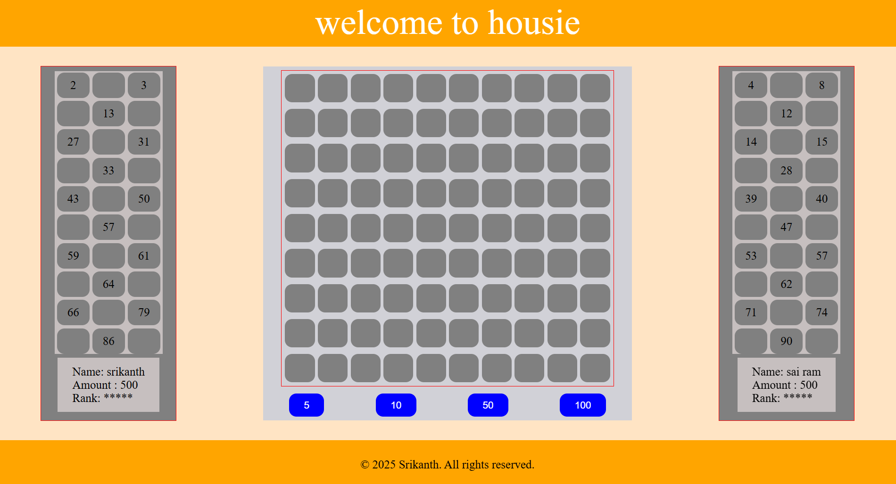
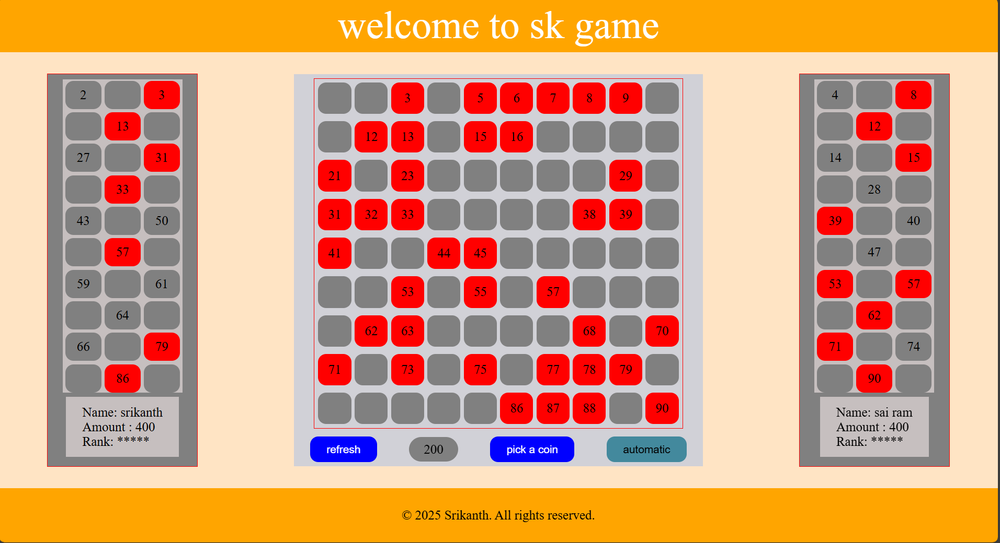

## ✅ **README.md**

# 🎉 Housie / Tambola Web Game
A fun, browser-based Housie (Tambola) game built using **HTML, CSS, and JavaScript**.  
It supports **two players**, random number generation, betting system, auto-play mode, audio effects, and winner detection.

## 🚀 Features

✅ Generate a game sheet with numbers **1–90**  
✅ Auto-generated **15-number tickets** for Player A & Player B  
✅ Random number picking (manual & automatic modes)  
✅ Audio feedback for coin pick & game completion  
✅ Betting options (5, 10, 50, 100)  
✅ Automatic winner detection  
✅ Player balance updates  
✅ Responsive UI for mobile & desktop  
✅ Restart / Refresh game option

---

## 🧑‍💻 Tech Stack

- **HTML5**
- **CSS3**
- **Vanilla JavaScript**
- No external libraries required

---

## 📂 Project Structure

/project-folder
│
├── index.html
├── /media
│   ├── tic.wav
│   ├── game_completed.wav
│   └── SK logo.png
└── README.md

Make sure the **media** folder contains the required audio files and icon.

---

## ▶️ How to Run

1. Download or clone the repository:  git clone https://github.com/your-username/housie-game.git

2. Open the project folder
3. Run by simply opening:

index.html

✅ No server required — works in any modern browser

---

## 🎮 How to Play

1. Enter Player A & Player B names when prompted
2. Choose a **bet amount** (5 / 10 / 50 / 100)
3. Click **Pick a Coin** to generate numbers manually
   OR hover over **Automatic** for auto-play
4. Matching ticket numbers turn **red**
5. First player to match all **15 numbers** wins!
6. Click **Refresh** to start a new game

---

## 🖼 UI Overview

* Center: Main game sheet (1–90 numbers)
* Left & Right: Player tickets & score
* Bottom: Controls (betting + pick/auto + refresh)

---

## 🔊 Audio Files

Ensure the following exist in `/media`:

* `tic.wav` → plays on each number pick
* `game_completed.wav` → plays when someone wins

---

## ✅ Future Enhancements (Optional)

* Multiplayer mode (more than 2 players)
* Online real-time gameplay with sockets
* Ticket generation UI instead of random
* Achievements & game history
* Dark mode theme

---

## 🙌 Credits

Developed by **Srikanth**
© 2025 — All rights reserved

---

## 📜 License

This project is for **personal and educational use**.
Feel free to modify and improve!

## 📸 Screenshot

